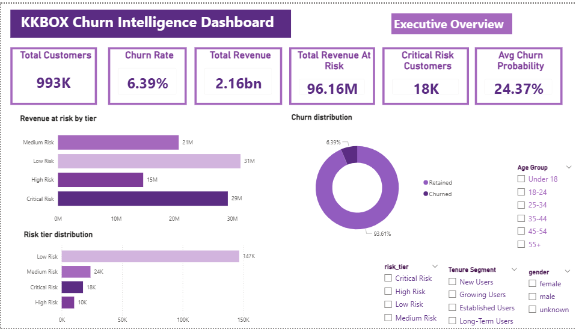
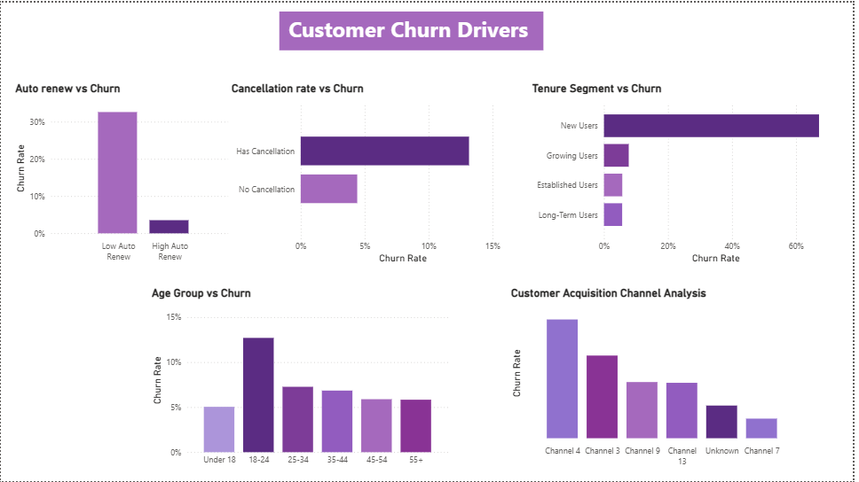
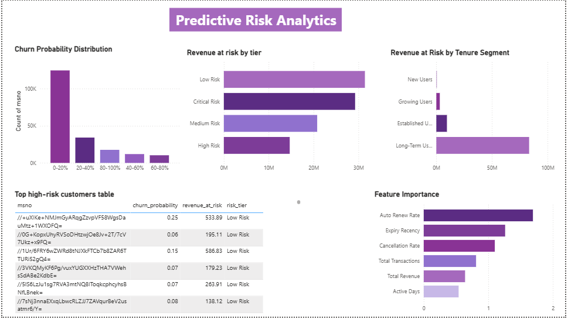

# Subscription Revenue Leakage & Churn Intelligence System

End-to-end churn intelligence and revenue-at-risk analytics project using SQL, Python, Machine Learning, and Power BI to identify churn drivers, predict customer churn probability, estimate financial exposure, and support retention-focused business decision-making.

---

# Business Problem

Subscription-based businesses often struggle with:

- Customer churn
- Revenue leakage
- Failed renewals
- Low customer retention
- Poor acquisition quality
- Hidden financial exposure from at-risk customers

This project builds a complete churn intelligence system to:

- Identify key churn drivers
- Analyze customer retention behavior
- Predict churn probability using Machine Learning
- Estimate revenue at risk
- Segment customers by risk level
- Support retention-focused business strategies

---

# Project Objectives

This project answers:

- Which customers are most likely to churn?
- What behavioral factors drive churn?
- Which acquisition channels bring poor-quality customers?
- How much recurring revenue is financially exposed?
- Which customers should retention teams prioritize?

---

# Tech Stack

- SQL (MySQL)
- Python
- Pandas
- NumPy
- Scikit-learn
- Imbalanced-learn (SMOTE)
- SciPy
- Power BI
- VS Code
- GitHub
- Git LFS

---

# Dataset Overview

The project uses large-scale subscription platform datasets containing:

- Customer demographics
- Subscription transactions
- Renewal behavior
- Cancellation behavior
- Listening activity logs
- Revenue patterns
- Customer churn labels

Dataset Source:

- KKBOX Churn Prediction Dataset  
  https://www.kaggle.com/competitions/kkbox-churn-prediction-challenge/data

---

# Project Workflow

## 1. Data Ingestion & SQL Pipeline

Large-scale raw datasets were loaded into MySQL using:

- SQL bulk loading
- Python automation
- Chunk-based ingestion pipelines

Datasets processed:
- Members data
- Transactions data
- User activity logs
- Churn labels

---

## 2. Data Cleaning & Validation

Comprehensive validation and cleaning performed for:

- Null value handling
- Invalid age filtering
- Unknown gender handling
- Expiry date correction
- Duplicate validation
- Referential integrity validation
- Suspicious payment detection
- Transaction date formatting

---

## 3. Transaction Feature Engineering

Behavioral and financial features engineered using SQL:

- Total transactions
- Total revenue
- Average payment revenue
- Membership tenure
- Cancellation rate
- Auto-renew rate
- Expiry recency
- Active transaction days
- Suspicious payment rate

---

## 4. User Behavior Feature Engineering

User listening behavior aggregated using Python:

- Average listening time
- Total listening seconds
- Active listening days
- Completion ratio
- Total plays
- Listening engagement metrics

---

## 5. Churn Base Creation

A master churn analytics table was created by combining:

- Customer demographics
- Transactional behavior
- User activity behavior
- Revenue metrics
- Churn labels

This created the final analytical dataset used for:
- EDA
- Statistical analysis
- Machine Learning
- Dashboarding

---

# Exploratory Data Analysis (EDA)

Key analyses performed:

## Customer Churn Analysis
- Overall churn distribution
- Customer retention segmentation
- Churn percentage analysis

## Behavioral Churn Drivers
- Auto-renew behavior vs churn
- Cancellation behavior vs churn
- Tenure vs churn
- Activity engagement vs churn

## Demographic Analysis
- Age-group churn analysis
- Gender distribution analysis
- Acquisition channel analysis

## Revenue Analysis
- Revenue by churn segment
- Revenue concentration analysis
- Revenue risk segmentation

---

# Statistical Analysis

Statistical techniques used:

## Distribution Analysis
- Skewness analysis
- Outlier detection
- Non-normality validation

## Probability Analysis
- P(churn | low auto-renew)
- P(churn | low activity)
- Retention probability analysis

## Hypothesis Testing
- Mann-Whitney U Test
- Chi-Square Test

## Correlation Analysis
- Engagement vs churn
- Revenue vs churn
- Renewal behavior vs churn

---

# Machine Learning — Churn Prediction Model

A Logistic Regression churn prediction model was built using:

- Feature scaling
- Missing value imputation
- Label encoding
- SMOTE imbalance handling
- Train-test split validation

---

## Model Evaluation Metrics

The model was evaluated using:

| Metric | Score |
|--------|-------|
| ROC-AUC Score | 0.9283 |
| Precision (Churn Class) | 0.33 |
| Recall (Churn Class) | 0.86 |
| F1-Score (Churn Class) | 0.47 |

> SMOTE was applied to handle class imbalance before model training.
> Model prioritizes Recall over Precision to minimize missed churn cases.

---

## Key Model Insights

Top churn-driving features identified:

- Auto-renew rate
- Expiry recency
- Cancellation rate
- Transaction activity
- Revenue behavior
- Customer engagement

---

# Revenue-at-Risk Intelligence

The project estimates:

## Financial Exposure
- Revenue at risk by customer
- Revenue exposure by risk tier
- Revenue concentration among high-risk users

## Risk Segmentation
Customers segmented into:
- Low Risk
- Medium Risk
- High Risk
- Critical Risk

## Retention Prioritization
High-risk high-value customers identified for:
- retention campaigns
- renewal interventions
- targeted customer actions

---

# Python Automation Pipeline

A complete automation pipeline was built to:

- Connect MySQL with Python
- Execute churn pipeline automatically
- Train churn prediction model
- Generate churn probabilities
- Estimate revenue-at-risk
- Export prediction outputs
- Generate dashboard-ready datasets

---

# Power BI Dashboard

The project includes a 3-page interactive Power BI dashboard.

---

# Dashboard Page 1 — Executive Overview

Features:
- KPI summary cards
- Total revenue at risk
- Customer churn distribution
- Risk tier distribution
- Executive churn overview
- Customer risk segmentation



---

# Dashboard Page 2 — Customer Churn Drivers

Features:
- Auto-renew vs churn analysis
- Cancellation behavior analysis
- Tenure vs churn analysis
- Age-group churn analysis
- Customer acquisition channel analysis



---

# Dashboard Page 3 — Predictive Risk Analytics

Features:
- Churn probability distribution
- Revenue-at-risk analysis
- Revenue exposure by tenure
- Feature importance visualization
- High-risk customer identification
- Predictive churn intelligence



---

# Key Business Insights

- Low auto-renew customers showed significantly higher churn probability
- New users exhibited the highest churn rates
- Cancellation behavior strongly correlated with churn
- Certain acquisition channels generated lower-quality customers
- High-risk customers contributed disproportionately high revenue exposure
- Estimated revenue-at-risk exceeded 96M+
- Customer engagement strongly impacted retention stability

---

# How to Run

Install dependencies:

```bash
pip install -r requirements.txt
```

Update database credentials inside:

```python
db_connection.py
```

Run automation pipeline:

```bash
python 09_automation_pipeline.py
```

---

# Power BI File

The Power BI dashboard file (`.pbix`) is tracked using Git LFS due to file size limitations.

To download large files correctly:

```bash
git lfs install
git clone <repository_url>
```

---

# Final Conclusion

This project demonstrates a complete end-to-end churn intelligence and revenue risk analytics workflow by integrating:

- SQL data engineering
- Behavioral feature engineering
- Statistical analysis
- Machine Learning
- Financial risk estimation
- Automation pipelines
- Executive dashboard storytelling

The final system enables businesses to:
- identify churn risk early,
- estimate financial exposure,
- prioritize retention actions,
- and improve subscription revenue stability.
